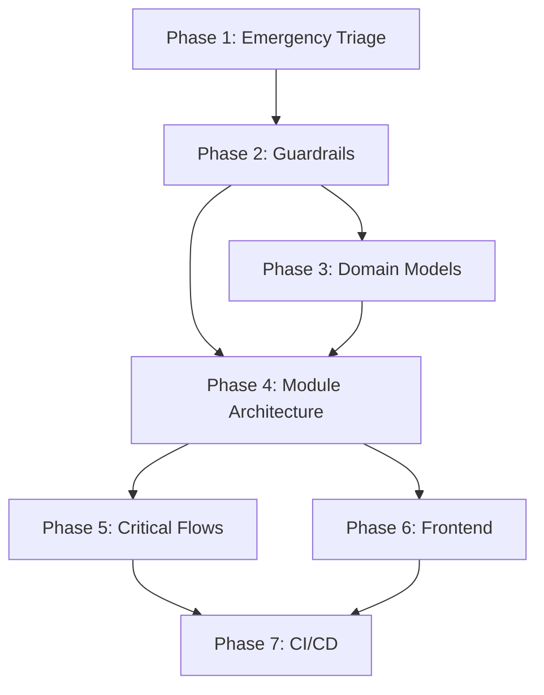

# AUTOLYTIQ CODEBASE STABILIZATION ORCHESTRATION PLAN

## CRITICAL ALERT: ARCHITECTURAL CHAOS DETECTED

**Date:** November 20, 2025
**Severity:** CRITICAL
**Impact:** Every bug fix cascades into new breaks
**Root Cause:** No architectural boundaries, tangled dependencies, inconsistent patterns

## CURRENT STATE ANALYSIS

### 1. Architectural Chaos Patterns Identified

#### A. Import Hell
- **Cross-layer imports:** Frontend importing directly from backend (`../server/`)
- **Circular dependencies:** Components importing from pages that import from components
- **Relative path chaos:** `../../../` imports everywhere instead of path aliases
- **No clear boundaries:** Everything can import everything

#### B. Module Anarchy
- **375 source files** with no clear organization
- Server files mixed: `email-webhook-routes.ts` at root level with `routes/customers.ts`
- No separation between:
  - Domain logic
  - API routes
  - Business services
  - Database access
  - External integrations

#### C. Type Safety Violations
- TypeScript `strict: true` but with dangerous escape hatches:
  - `skipLibCheck: true` hiding type errors
  - `allowImportingTsExtensions: true` breaking builds
  - No enforced null checking in many files
  - `any` types scattered throughout

#### D. Testing Desert
- 277 test files but mostly for tax engine
- **ZERO integration tests** for critical business flows
- No E2E tests for user workflows
- No test coverage requirements

#### E. Configuration Chaos
- **NO ESLint configuration** - zero code quality enforcement
- **NO Prettier configuration** - inconsistent formatting
- **NO git hooks** - bad code enters repository freely
- **NO CI/CD pipeline** - no quality gates

#### F. Frontend Pattern Explosion
- Multiple styling approaches:
  - Inline Tailwind classes
  - CSS modules
  - Global CSS (28KB index.css)
- Component patterns mixed:
  - Class components
  - Function components
  - Custom hooks with no standards
- No component library structure

## STABILIZATION EXECUTION PLAN

### Phase 1: Emergency Triage (IMMEDIATE)
**Duration:** 4 hours
**Priority:** CRITICAL
**Blocking:** Everything

#### Tasks:
1. Create stabilization branch
2. Document all breaking dependencies
3. Map critical business flows that CANNOT break
4. Identify immediate fire patches needed

### Phase 2: Guardrails Setup (PRIORITY)
**Duration:** 6 hours
**Priority:** CRITICAL
**Blocking:** All new code

#### Tasks:
1. **TypeScript Fortress Configuration**
   ```json
   {
     "compilerOptions": {
       "strict": true,
       "strictNullChecks": true,
       "strictFunctionTypes": true,
       "strictBindCallApply": true,
       "strictPropertyInitialization": true,
       "noImplicitAny": true,
       "noImplicitThis": true,
       "noImplicitReturns": true,
       "noFallthroughCasesInSwitch": true,
       "noUnusedLocals": true,
       "noUnusedParameters": true,
       "noUncheckedIndexedAccess": true,
       "skipLibCheck": false
     }
   }
   ```

2. **ESLint Architectural Enforcement**
   - Plugin: `eslint-plugin-boundaries`
   - Rules:
     - No cross-module imports
     - No circular dependencies
     - No backend imports in frontend
     - No direct database access outside repositories

3. **Prettier + Git Hooks**
   - Pre-commit: Format + Lint + Type check
   - Pre-push: Test + Build verification
   - Commit-msg: Enforce conventional commits

### Phase 3: Domain Model Stabilization
**Duration:** 8 hours
**Priority:** HIGH
**Blocking:** API consistency

#### Canonical Models to Define:
1. **Customer Domain**
   - Customer entity
   - Contact information
   - Credit application
   - Deal history

2. **Deal Domain**
   - Deal entity
   - Vehicle selection
   - Trade-in
   - Financing
   - Tax calculations

3. **Vehicle Domain**
   - Vehicle entity
   - Inventory status
   - Pricing
   - Features

4. **Tax Domain**
   - Tax calculation request
   - Tax breakdown
   - Local tax rates
   - State rules

5. **Email Domain**
   - Email message
   - Thread
   - Attachment
   - Template

#### Implementation:
- Zod schemas for all models
- Single source of truth in `/shared/models/`
- Auto-generated TypeScript types
- Runtime validation on all API boundaries

### Phase 4: Module Architecture
**Duration:** 12 hours
**Priority:** HIGH
**Blocking:** Future development

#### New Structure:
```
/modules/
  /customer/
    /domain/      # Domain models and business logic
    /repository/  # Database access
    /service/     # Business services
    /api/         # Express routes
    /client/      # React components

  /deal/
    /domain/
    /repository/
    /service/
    /api/
    /client/

  /vehicle/
  /tax/
  /email/
  /auth/
  /shared/        # Truly shared utilities only
```

#### Rules:
1. Modules can only import from:
   - Their own module
   - `/shared/` utilities
   - Explicitly declared dependencies

2. API contracts through:
   - GraphQL gateway (future)
   - REST with OpenAPI specs (current)
   - Event bus for async communication

### Phase 5: Critical Flow Protection
**Duration:** 8 hours
**Priority:** CRITICAL
**Blocking:** Production stability

#### Core Flows to Protect:
1. **User Authentication Flow**
   - Login
   - Session management
   - Role-based access

2. **Deal Creation Flow**
   - Customer selection
   - Vehicle selection
   - Tax calculation
   - Deal save

3. **Email Integration Flow**
   - Inbox sync
   - Message threading
   - Send/receive

#### Protection Strategy:
- Integration tests for each flow
- Database transaction rollback tests
- API contract tests
- Performance benchmarks

### Phase 6: Frontend Consistency
**Duration:** 10 hours
**Priority:** MEDIUM
**Blocking:** UI development

#### Consolidation Tasks:
1. **Single Component Pattern**
   - Function components only
   - TypeScript props with defaults
   - Standardized hooks pattern

2. **Styling Approach**
   - Design tokens only
   - Component library with variants
   - No inline Tailwind
   - CSS-in-JS for dynamic styles

3. **Data Fetching Pattern**
   - React Query for all API calls
   - Centralized error handling
   - Optimistic updates
   - Cache management

4. **Layout System**
   - UniformShell for all pages
   - Consistent navigation
   - Responsive breakpoints
   - Accessibility standards

### Phase 7: CI/CD Pipeline
**Duration:** 6 hours
**Priority:** HIGH
**Blocking:** Deployment safety

#### Quality Gates:
1. **Pre-merge Checks**
   - TypeScript compilation
   - ESLint pass
   - Unit tests pass
   - Integration tests pass
   - Build succeeds

2. **Deployment Pipeline**
   - Automated testing
   - Database migration validation
   - Performance regression tests
   - Rollback capability

## DEPENDENCY GRAPH



## CRITICAL PATH

1. **Guardrails MUST be in place first** - No code enters without passing checks
2. **Domain models before module migration** - Need stable contracts
3. **Module architecture enables parallel work** - Teams can work independently
4. **Critical flow tests before any refactoring** - Safety net required

## RISKS & MITIGATIONS

### Risk 1: Breaking Production During Stabilization
**Mitigation:**
- All work on `stabilization` branch
- No production deployments until Phase 5 complete
- Feature freeze during stabilization
- Database backup before each phase

### Risk 2: Developer Resistance to Strict Rules
**Mitigation:**
- Gradual enforcement with warnings first
- Clear documentation of benefits
- Automated fixes where possible
- Team training on new patterns

### Risk 3: Performance Degradation
**Mitigation:**
- Benchmark current performance first
- Performance budget enforcement
- Bundle size monitoring
- Database query analysis

## SUCCESS METRICS

### Phase Completion Criteria:
- [ ] TypeScript strict mode: ZERO type errors
- [ ] ESLint: ZERO violations
- [ ] Test coverage: >80% for critical paths
- [ ] Build time: <30 seconds
- [ ] API response: <100ms P95
- [ ] Frontend TTI: <1.5 seconds
- [ ] Zero runtime errors in production

### Overall Success:
- [ ] Bug fix no longer cascades into new breaks
- [ ] New features developed 3x faster
- [ ] Deployment confidence: HIGH
- [ ] Developer happiness: IMPROVED
- [ ] Code physically rejects bad patterns

## IMMEDIATE NEXT STEPS

1. **Create stabilization branch:**
   ```bash
   git checkout -b stabilization/architectural-rebuild
   ```

2. **Set up initial guardrails:**
   - Install ESLint + plugins
   - Configure TypeScript strict
   - Set up Prettier
   - Install husky for git hooks

3. **Document current breaking points:**
   - List all known bugs
   - Map dependency violations
   - Identify critical user flows

4. **Begin Phase 2 implementation**

## AGENT COORDINATION

### Specialized Agents Required:
1. **database-architect**: Design repository patterns and migrations
2. **workhorse-engineer**: Implement module restructuring
3. **frontend-design-specialist**: Consolidate UI patterns
4. **test-generator**: Create integration test suite
5. **code-reviewer**: Enforce new architectural rules

### Coordination Protocol:
- Daily sync on progress
- Blocking issues escalated immediately
- Parallel work where dependencies allow
- Continuous integration of completed phases

## STABILIZATION BRANCH RULES

1. **NO new features** during stabilization
2. **ONLY fixes that reduce complexity**
3. **Every commit must pass ALL checks**
4. **Documentation required for every change**
5. **Code review by architectural enforcer**

---

**STATUS:** READY TO EXECUTE
**BRANCH:** To be created
**ESTIMATED DURATION:** 54 hours (7 business days with parallel work)
**TEAM SIZE REQUIRED:** 3-5 developers
**RISK LEVEL:** HIGH but manageable with proper coordination

This plan will transform the codebase from chaos to a self-healing, architecturally-sound system that physically rejects bad code.